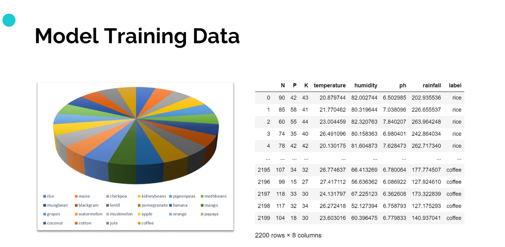
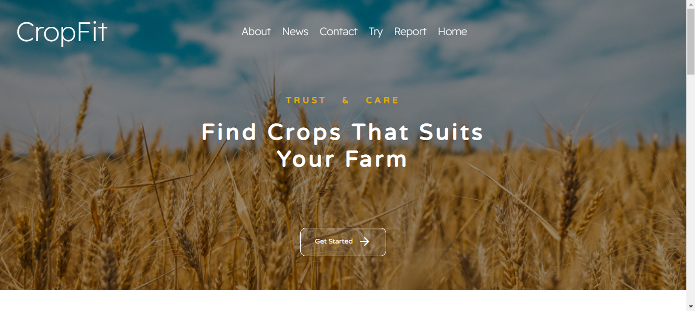
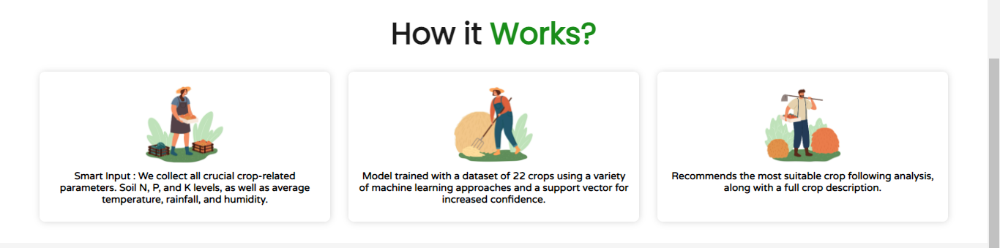
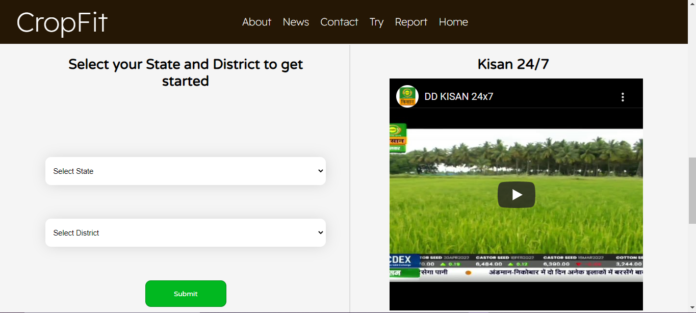
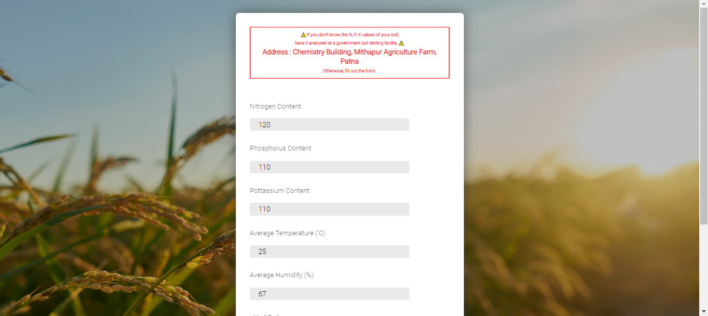
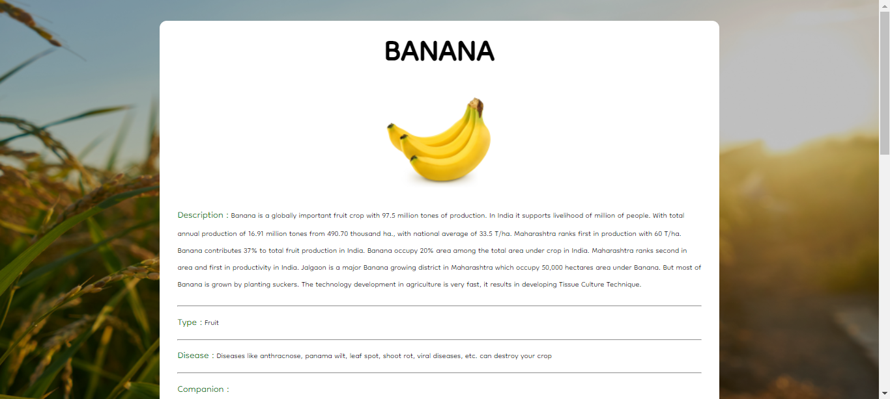

# Project Title : CROPFIT - platform to help farmers take informed decisions.

 A vast majority of the Indian farmers believe in depending on their intuition to decide which crop to sow in a particular season. They find comfort in simply following the ancestral farming patterns and norms without realizing the fact that crop output is circumstantial, depending heavily on the present-day weather and soil conditions. 

 However, a single farmer cannot be expected to take into account all the innumerable factors that contribute to crop growth before reaching a consensus about which one to grow. 

 Our project solves this problem by using a combination of analytics and machine learning so that the farmers can make a more informed decision.


## project structure
Static and Templates folder contain images, css, javascript and html of webpages.

Datasets used :
- temp.xls : average temprature, humidity and rainfall of region for autofilling the form if user does not have inputs.
- soil.xls : address of nearest soil testing laboratory based on state and district of user.
- crop_description : description of various crops which our model will predict.
- crop_recommendation.csv : dataset used to train the model.



model.py and model.ipynb contain the trained model and accuracies of various classifiers used.

model.pkl is the binary format of trained model.


app.py is the main application using flask.

soil.py and tempa.py are used for extracting address of nearest soil testing facility and Av. rainfall, humdity and temperature based on user location. 

requirements.txt contains all requirements needed to run this application locally.


## Run Locally

Clone the project

```bash
  git clone https://github.com/vineettanwar/farmeasy_crop.git
```

Go to the project directory

```bash
  cd cropfit
```

Install requirements

```bash
  pip install -r requirements.txt
```

run app.py 

```bash
  run app.py from farmeasy_crop
```

## USE WITHOUT INSTALLATION
 LINK : https://cropfitt.herokuapp.com/
 use above link to use and access application without installation 


## Screenshots







## youtube video link
https://youtu.be/TF2269nMgTw
